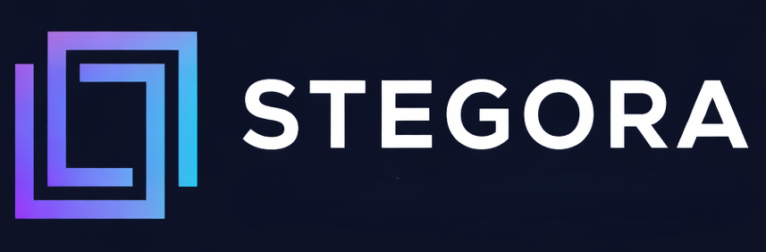

# Image Steganography

A web application for hiding secret images within cover images using alpha-blending steganography.



## 🔗 Live Demo

**[https://image-stego-c5n5.onrender.com](https://image-stego-c5n5.onrender.com)**

> Note: Free tier may take ~50 seconds to wake up on first request.

## ✨ Features

- **Encode**: Hide a secret image inside a cover image
- **Decode**: Extract the hidden image from a stego image
- **Adjustable Alpha**: Control the blend strength (0.1 - 1.0)
- **Image Enhancement**: Automatic contrast and sharpness boost for decoded images
- **Responsive UI**: Works on desktop and mobile

## 🛠️ Tech Stack

### Frontend
- React 18 + Vite
- CSS3 with responsive design

### Backend
- FastAPI (Python)
- NumPy + Pillow for image processing

### Deployment
- Docker containerized
- Hosted on Render

## 🚀 How It Works

### Encoding
The secret image is blended into the cover image using alpha compositing:
```
stego = (1 - α) × cover + α × secret
```

### Decoding
The secret is extracted by reversing the blend:
```
secret = (stego - (1 - α) × cover) / α
```

## 📦 Local Development

### Prerequisites
- Node.js 18+
- Python 3.11+

### Frontend
```bash
npm install
npm run dev
```

### Backend
```bash
cd server
pip install -r requirements.txt
uvicorn main:app --reload
```

### Docker
```bash
docker compose up --build
```

## 📁 Project Structure

```
├── src/                    # React frontend
│   ├── App.jsx            # Main app component
│   ├── pages/             # Page components
│   └── App.css            # Styles
├── server/                 # FastAPI backend
│   ├── main.py            # API endpoints
│   ├── requirements.txt   # Python dependencies
│   └── Dockerfile.render  # Production Dockerfile
├── public/                 # Static assets
├── render.yaml            # Render deployment config
└── docker-compose.yml     # Local Docker setup
```

## 🔧 API Endpoints

| Endpoint | Method | Description |
|----------|--------|-------------|
| `/api/health` | GET | Health check |
| `/api/encode` | POST | Encode secret into cover |
| `/api/decode` | POST | Decode secret from stego |

### Encode Request
```bash
curl -X POST https://image-stego-c5n5.onrender.com/api/encode \
  -F "cover=@cover.png" \
  -F "secret=@secret.png" \
  -F "alpha=0.1" \
  --output stego.png
```

### Decode Request
```bash
curl -X POST https://image-stego-c5n5.onrender.com/api/decode \
  -F "cover=@cover.png" \
  -F "stego=@stego.png" \
  -F "alpha=0.1" \
  --output decoded.png
```

## 📝 Usage Tips

1. **Alpha Value**: Lower alpha (0.1-0.2) makes the hidden image less visible but harder to extract cleanly
2. **Image Quality**: Use PNG format to avoid compression artifacts
3. **Same Cover**: You need the original cover image to decode the secret
4. **Image Size**: Secret image is automatically resized to match cover dimensions

## 🤝 Contributing

1. Fork the repository
2. Create a feature branch
3. Commit your changes
4. Push to the branch
5. Open a Pull Request

## 📄 License

MIT License - feel free to use this project for learning or personal projects.

---

Made with ❤️ by [Shubh Gupta](https://github.com/Shubh-Gupta-12)
